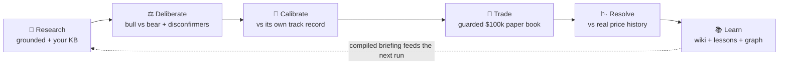

# Evolving Portfolio  — a self‑improving AI trader

> An AI that researches stocks, trades its own paper book, **grades every call against real outcomes**,
> and compiles what it learns into an evolving **wiki + knowledge graph** — so its decisions get sharper
> over time. Runs locally, works with zero API keys, and is auditable end to end.
>
> **Paper‑trading only. For research and education. Not investment advice.**

> 🧠 **Inspired by [Andrej Karpathy](https://twitter.com/karpathy)'s idea of an LLM that maintains its own
> evolving _wiki_.** Instead of re‑reasoning from scratch each run, this system distills what it learns
> into a compact, trusted **wiki + knowledge graph** and *compiles* it back into every decision — the
> guiding principle throughout is **"compile, don't re‑derive."**

Built with **Bun · TypeScript · SQLite · React · Tailwind**. Your real holdings are mirrored
**advisory‑only and can never place orders**; a separate self‑contained **$100k AI paper book** trades
on its own and is benchmarked A/B against you and SPY.

---

## The idea

Most "AI stock picker" tools generate a fresh opinion every day and forget it. This is the opposite — a
**closed learning loop** where the system accumulates and *compiles* its own knowledge:

- It **journals every recommendation** immutably, turns actionable calls into **scored forecasts**, and
  later **resolves them against real historical prices** (no lookahead).
- It compiles those outcomes into a deterministic **performance wiki** — hit‑rate, expectancy, Brier
  calibration, stated‑vs‑realized conviction — and distills **evidence‑gated lessons** that get injected
  back into the next run as trusted context.
- Before each trade it runs a structured **bull/bear deliberation**, then **calibrates its conviction**
  against what that *kind* of call has actually achieved — borrowing from the sector/strategy track
  record (a knowledge‑graph blend) when a ticker has little history of its own.
- All of it lives on a **knowledge graph you can walk** — tickers, sectors, theses, lessons, and
  sources connected by typed edges, with an LLM **graph‑librarian** that maintains the connections.

The result is a trader whose confidence is *earned from its own measured record*, not asserted.

## The self‑improvement loop



Each loop the AI knows a little more about **what works** — and the dashboard lets you see exactly why it
decided what it did.

## Quickstart

**Prerequisites:** [Bun](https://bun.sh) (the only runtime — no separate Node/npm needed).

```bash
git clone <this-repo> && cd portfolio
bun install
cp .env.example .env      # defaults to MARKET_ADAPTER=fake — no keys required
bun run db:migrate
bun run dev               # API on :8787 + dashboard on :5173
```

Open **<http://localhost:5173>**, hit **Manage** to add a few holdings or watchlist tickers, then click
**Run analysis**. With no API keys the whole pipeline runs against **deterministic fake adapters**, so you
can explore every feature offline. Add real keys (below) whenever you want live data and real LLM analysis.

## What's inside

- **Three‑stage analysis (Decision Engine v2)** — `research → deliberate → structure`. A forced bull/bear
  deliberation with disconfirmers and a base‑rate check precedes every verdict, persisted and shown in the UI.
- **Graph‑propagated calibration** — empirical‑Bayes shrinkage over the ticker's sector / strategy /
  overall cohorts dampens conviction toward its realized record. **Dampen‑only**, and it writes a
  *separate* `calibratedConviction` so the wiki's honesty metric is never corrupted.
- **Guarded AI paper trading** — a **deterministic planner** turns the holder‑neutral thesis
  (direction / conviction / target / stop) into sized, **regime‑aware** orders filled against an isolated
  DB ledger. The LLM never sizes or gates; every decision is logged with a reason.
- **Typed journal + forecast resolution** — immutable record of every call; deterministic grading against
  historical high/low bars with lookahead protection and ambiguous‑touch handling.
- **Performance wiki + calibration** — deterministic cohort metrics and evidence‑gated lessons compiled
  into the briefing injected into future analysis.
- **Research knowledge base** — upload PDFs / Markdown / text, snapshot URLs, write notes; scoped excerpts
  are retrieved (graph‑aware) as **delimited, untrusted** evidence with SSRF guards and sanitization.
- **Knowledge graph (+ interactive viz)** — `kg_nodes` / `kg_edges` tie everything together; the dashboard
  renders a navigable **ego graph** (click any node to re‑center), and an **LLM graph‑librarian** proposes
  gated `related_to` / `contradicts` edges each run.
- **Grounded "ask your portfolio"** — a Gemini tool‑use loop answers only from *your own* journal /
  forecasts / wiki / trades / graph, streaming the answer plus the tools and sources it used.
- **Risk analytics** — max drawdown, Sharpe, volatility, and excess return + beta vs SPY for both books.

## How the daily run works

`dailyRun` is the single composable operation behind both the manual trigger and the local scheduler:

```text
 1. Sync and price portfolios (user + AI paper)
 2. Resolve due forecasts against historical high/low bars
 3. Compile the active wiki briefing (calibration + open book)
 4. Gather market context (SPY trend + FRED macro + searched narrative)
 5. Build held + watchlist + scan + AI-thesis universe
 6. Retrieve scoped research-library evidence (graph-aware)
 7. Analyze tickers (three-stage: research → deliberate → structure)
 8. Calibrate conviction from the wiki track record (graph-propagated, dampen-only)
 9. Persist report + journal + scored forecasts + theses; graph-librarian enriches concept edges
10. Propose and execute guarded AI paper trades (deterministic, regime-aware planner)
11. Re-price the AI book and persist snapshots → stream completion to the UI
```

One failing ticker or source never discards the report — the run degrades gracefully.

## Dashboard

| Section | What it shows |
|---|---|
| **Overview · equity curve · risk** | You vs AI paper vs SPY, plus drawdown / Sharpe / vol / alpha |
| **Daily recommendations** | Position-aware cards with the bull/bear deliberation and the stated → calibrated conviction chain; live stream during a run |
| **Market view** | The AI's regime call + sector / theme leans for the day |
| **AI trading** | The $100k paper book: auto-trade status and trade log |
| **Journal** | Day-grouped calls → thesis, deliberation, calibration, forecast contract, outcome, linked trades |
| **Knowledge graph** | The navigable ego graph — walk from any node to its connections |
| **Knowledge libraries** | Your uploads / URLs / notes, and the AI's self-curated facts |
| **Performance wiki** | Active briefing, evidence-gated lessons, calibration metrics (with plain-English tooltips) |
| **Ask your portfolio** | Grounded NL query, answered only from your own data |

Every recommendation exposes its **reasoning chain** (deliberation + per-cohort calibration), and the
live stream + query both surface the LLM's **tool calls and cited sources** — nothing is a black box.

## Configuration (optional keys)

All keys are optional and live in `.env` only. Missing keys degrade gracefully to deterministic fakes.

| Service | Env key(s) | Purpose | Verify |
|---|---|---|---|
| **Alpaca** (paper) | `MARKET_ADAPTER=alpaca`, `ALPACA_KEY_ID`, `ALPACA_SECRET`, `ALPACA_PAPER=true` | Market data + the AI book's **paper** brokerage | `bun run alpaca:smoke` |
| **Gemini** | `GEMINI_API_KEY` (+ `GEMINI_MODEL`, default `gemini-3.5-flash`) | LLM analysis + grounded query; falls back to deterministic reports | `bun run gemini:smoke` |
| **FMP** | `FMP_API_KEY` | Fundamentals and screener candidates | `bun run fmp:smoke` |
| **FRED** | `FRED_API_KEY` | Rates, curve, CPI, unemployment, VIX macro | `bun run fred:smoke` |
| **Finnhub** | `FINNHUB_API_KEY` | Analyst consensus and upcoming earnings | `bun run finnhub:smoke` |

> **Paper‑only guard.** The app **refuses to start** with `MARKET_ADAPTER=alpaca` unless
> `ALPACA_PAPER=true`. There is no live‑money adapter and no real‑portfolio execution path; the manually
> entered user portfolio is advisory‑only and can never place orders.

## Architecture

```text
src/
├── analysis/      technicals, market context, universe, scan, regime + conviction calibration, performance
├── config/        env loading and paper-only validation
├── db/            SQLite connection, migrations, repositories
├── domain/        Zod schemas and shared API types
├── execution/     deterministic trade planner + self-contained AI ledger
├── fundamentals/  fake, FMP, and Finnhub-backed enrichment
├── knowledge/     research-library ingestion, retrieval, curation, and the LLM graph-librarian
├── llm/           Gemini adapter, prompts, schemas, streaming
├── macro/         fake and FRED-backed macro snapshots
├── market/        fake and Alpaca MarketGateway adapters
├── pipeline/      dailyRun orchestration, journaling, live events
├── query/         grounded NL query — read-only tools + Gemini tool-use loop
├── resolution/    historical high/low provider + deterministic forecast grading
├── scheduler/     once-per-day automatic run trigger
├── server/        Hono HTTP API
└── wiki/          deterministic cohort metrics, lessons, calibration, briefing
web/               React + Vite + Tailwind + Recharts + TanStack Query
```

The frontend shares the backend's contract **types** through the `@shared` alias (single source of truth).
Every external integration is a typed port with a **deterministic fake** and a real adapter, injected
through a single `App` object (`src/app.ts`) — which is why the whole thing runs offline.

The canonical design lives in [`docs/architecture-and-roadmap.md`](docs/architecture-and-roadmap.md);
the free‑first data‑source plan is in [`docs/integrations-roadmap.md`](docs/integrations-roadmap.md).

## Scripts

| Command | What it does |
|---|---|
| `bun run dev` | Run backend + Vite together |
| `bun run server` | Backend API only on `:8787` |
| `bun run db:migrate` | Create or upgrade the SQLite schema |
| `bun test` | Run unit + integration tests |
| `bun run build:web` | Build the production frontend |
| `bun run {alpaca,gemini,fmp,fred,finnhub}:smoke` | Verify a provider's credentials |

## Principles & guardrails

- **Paper only.** No real‑money path; AI execution is hard‑gated to confirmed Alpaca paper mode.
- **The user portfolio can never trade.** Advisory‑only, permanently.
- **Compile, don't re‑derive.** The LLM reads the deterministic, linted briefing and delimited evidence —
  never the raw journal or graph. The wiki never turns model prose into "learned" facts.
- **Calibration never rewrites the record.** Conviction is dampened into a *separate*
  `calibratedConviction`; the model's stated conviction is preserved, so the feedback loop can't self‑eat.
- **The LLM enriches the web of concepts; deterministic code owns the scoreboard.** The graph‑librarian
  only adds gated, source‑tagged associative edges — never metrics, calibration, or forecasts.
- **Uploaded content is untrusted.** It's injected only into the research stage inside a delimited block —
  never into sizing, gating, or execution.
- **Resolve without lookahead.** Outcomes use only data available after the forecast timestamp; resolution
  logic is versioned and never silently rewritten.

## Disclaimer

This project is for **research and education**. It executes **paper trades only** and has no live‑money
path. Nothing it produces is financial advice, and past simulated performance does not predict future
results. Use at your own risk.
