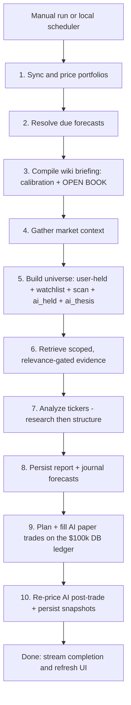

# Portfolio Intelligence Platform — Living Architecture and Build Roadmap

> **Scope and disclaimer.** This is a personal research and analysis tool. The user portfolio is
> advisory-only. Brokerage actions are restricted to an Alpaca **paper** account used by the AI
> shadow portfolio. Recommendations are model outputs, not investment advice. Treat backtests with
> suspicion because lookahead and survivorship bias can make weak strategies look strong.

> **Living document — keep it current.** Update this file in the *same change* whenever you alter the
> daily-run pipeline (`src/pipeline/`), the three memory systems (journal, knowledge base, performance
> wiki), the execution planner + ledger (`src/execution/`), the universe/scan logic (`src/analysis/`),
> the LLM prompt stages (`src/llm/`), the data model (`src/db/schema.ts` migrations), or a data
> provider. Add a table, a pipeline step, or a memory layer → reflect it here and bump *Last updated*.
> _Last updated: 2026-06-03 (AI Knowledge Platform Phase 3 complete: theses + Market View)._

## 1. Product direction

The platform mirrors manually entered real-world holdings, runs a daily market-analysis pipeline,
and compares the user's portfolio with an AI-driven paper portfolio and SPY. Each recommendation
already includes a structured forward prediction. The next major objective is to persist those
recommendations, add auditable paper-only execution, resolve forecast outcomes honestly, and compile
evidence-backed lessons into future analysis.

The long-term memory design follows a “compile, don't re-derive” knowledge-base pattern:

1. **Research library** — user-uploaded documents, URL snapshots, and notes retrieved as cited
   evidence during ticker research.
2. **Typed journal** — immutable recommendations, forecasts, trade decisions, outcomes, and evidence
   links for exact statistics and auditability.
3. **Performance wiki** — deterministic metrics plus versioned prose lessons compiled from resolved
   forecasts and injected into subsequent analysis prompts.

These are separate systems. Uploaded text is evidence, not instruction. Wiki prose summarizes
computed facts; it does not replace the database or grade the model from memory.

## 2. Current implementation

### Implemented

- Bun + TypeScript single-repo application with SQLite, migrations, Zod schemas, and Hono routes.
- React/Vite dashboard with Tailwind, Recharts, TanStack Query, streamed analysis status, holdings
  manager, watchlist manager, risk selector, scheduling dialog, recommendation cards, and portfolio
  comparison views.
- User portfolio mirror with manually entered holdings, optional cost basis, and cash.
- AI shadow portfolio pricing sourced from the selected market gateway's paper-account positions.
- Fake deterministic adapters for offline development and tests.
- Alpaca REST market-data and paper-brokerage adapter with a hard `ALPACA_PAPER=true` startup guard.
- Gemini analysis with schema validation and deterministic fake-report fallback.
- FMP fundamentals and screens, FRED macro data, and Finnhub analyst-consensus / earnings enrichment.
- Market context, technical calculations, watchlist + scan universe building, thematic discovery,
  position-aware verbs, structured predictions, live SSE events, run logs, and snapshot persistence.
- Cooldown-based local scheduling: run on app open or wake, or by the selected local time, whichever
  comes first — but never within a configurable cooldown window (default 4h) of the previous run, so
  reopening the laptop repeatedly through the day re-runs without spamming runs. The cooldown is
  derived from the last run's `started_at` in the `runs` table, so manual runs count toward it too.
- Contribution-neutral return calculation work for portfolio summary performance.
- **Typed journal (3A):** every recommendation persisted as an immutable `journal_entries` row with
  its full context and citations; complete actionable `BUY/ADD/TRIM/SELL` plans additionally become
  `scored_forecasts`. Journal list/detail API and a **day-grouped** dashboard view: a collapsible list
  of days, each expanding to that day's calls. Same-day re-runs are deduped to the latest call per
  ticker (`listDay`), while every run's entry is retained for audit and the per-ticker history view.
- **Forecast resolution (3D):** deterministic grading of due forecasts against historical daily
  high/low bars (Alpaca `adjustment=all`, fake provider for tests), with lookahead protection,
  ambiguous-touch handling, terminal/SPY-excess/MFE/MAE/R, and versioned, immutable `forecast_outcomes`.
  Runs before analysis in `dailyRun`.
- **Research knowledge base (3C):** PDF/Markdown/text/URL/note ingestion with SSRF guards, HTML
  sanitization, content classification/quarantine, immutable hashed versions, and SQLite FTS5 chunks.
  Graph-aware retrieval injects approved, scoped excerpts into the LLM research stage as delimited
  untrusted evidence; usage is recorded in `recommendation_evidence`. Knowledge-library UI with
  trust/scope/version/quarantine display and private-note opt-in.
- **Performance wiki + calibration (Phase 4):** deterministic cohort metrics (hit-rate, expectancy,
  stated-vs-realized conviction, Brier, vs-SPY) from resolved outcomes; evidence-gated prose lessons
  (n≥5 provisional, n≥20 active) with linting; a compact, deduped table briefing injected into future
  analysis as trusted computed context. Wiki UI with briefing, lessons, and calibration.
- **Knowledge-graph substrate:** `kg_nodes` / `kg_edges` connect tickers, themes, sources, lessons,
  and strategies with stable slug ids and typed, bidirectionally-queryable edges; powers graph-aware
  retrieval and lesson provenance. Graph query API.
- **Always-on AI paper trading (Phase 3B):** the AI autonomously manages its own paper book. Its own
  positions join the analysis universe each run, and a **deterministic planner** turns the holder-neutral
  thesis (direction/conviction/target/stop) into BUY/ADD/TRIM/SELL orders — the LLM never sizes or gates.
  `trade_decisions` is an auditable proposed/skipped/filled log, linked to the journal entry + scored
  forecast. The UI shows the trade log + the AI's risk preset.
  - **Capital model:** the AI book is a **self-contained DB-backed ledger** funded at a fixed
    `AI_STARTING_CASH` ($100k), independent of the user's portfolio and any live broker. It sizes against
    its own compounding equity; fills are simulated deterministically and mutate its own holdings + cash
    (`execution/ledger.ts`) in one transaction. **Always-on** — no seeding, no pause/auto-execute toggle.
    A one-time migration (`016_reset_ai_book`) resets the book to a clean $100k on existing DBs; the old
    `execution_settings` table and `/execution/seed` + settings endpoints are retired.
- **Mature risk controls (Phase 5):** `RISK_PRESETS` now fully govern the AI execution planner —
  per-preset reward:risk floor, allowed forecast horizons, and strategy-family eligibility (loose match;
  aggressive = all), on top of position size/count/confidence. The user's advisory book and the AI's
  paper book carry **independent** risk presets (`/api/risk?portfolio=ai`), each settable in the UI.
  - **Thesis-driven position sizing:** rather than filling every entry to the per-position cap, the
    planner sizes each position to a fraction of that cap derived from the thesis — the product of
    normalized **conviction** and **reward:risk** (`sizeFraction` in `execution/plan.ts`). Stronger,
    higher-payoff ideas approach the cap; weak-but-passing ones get a 25% floor (no dust). ADDs top a
    held name up to its thesis-sized target, not the full cap. Sizing stays deterministic — the planner
    owns it, the LLM still never sets size.
- **Grounded NL query (Phase 5):** "ask your portfolio anything" — a Gemini tool-use loop over 9
  read-only data tools (`src/query/`) answers from the journal / forecasts / outcomes / wiki / trades /
  graph / research only (never recall), streams the answer + cited tools over SSE, and logs every Q&A to
  `query_log`. API `POST /api/query` + `GET /api/query/:id/stream`; an "Ask your portfolio" UI panel.
  - **`@`-mention focus:** the input autocompletes tickers from the mentionable universe (holdings ∪ AI
    book ∪ watchlist, `GET /api/query/tickers`). Mentioned tickers become `focusTickers` (client hint +
    server re-parse) that instruct the model to scope its tool calls by ticker — hitting the narrow
    scoped + graph-linked retrieval tiers instead of a broad FTS sweep (token efficiency). `list_lessons`
    payloads are summarized for the same reason; full prose still reaches the UI as a source card.
  - **Structured sources:** each evidence tool (`knowledge_search`, `list_lessons`, `journal_calls`)
    derives `Citation[]` from its own result via an optional `cite()` — UI-only, never fed back to the
    model, so it costs no extra tokens. Citations carry a `sourceId` and stream over SSE, render as a
    grouped Sources panel (Research / Wiki / Journal), and persist in `query_log.citations_json`
    (migration 017).
  - **Chat UI:** the panel is a stacked session transcript (question bubble scrolls up, input clears,
    auto-scroll) with **markdown-rendered** answers (`Markdown.tsx`, react-markdown + remark-gfm, no
    typography plugin — mapped to the app's tokens). Every source card is clickable → `SourceDetailDialog`
    fetches the full record (journal thesis + forecast/outcome via `/api/journal/:id`, full lesson prose
    via `/api/wiki/lessons/:id`, or a research note's excerpt + origin link via `/api/knowledge/sources/:id`).
  - **Multi-round tool fix:** Gemini 2.5 attaches a `thoughtSignature` to every function-call part that
    the API requires echoed back verbatim; `toGenaiContents` now round-trips it through the neutral turn
    type (dropping it 400'd every query that needed a second tool round).
- **Thesis-driven AI universe + continuity (recent):** the AI's hunting universe is no longer dominated
  by the user's portfolio. Each run it merges its own holdings (`ai_held`) and its **carried-forward
  theses** (`ai_thesis` = open forecasts + names it recently rated BUY/ADD/WATCH within a lookback) with a
  *focused* fresh scan — so its focus grows from its own research rather than a brute-force daily scan
  (`src/analysis/aiUniverse.ts`, `universe.ts`; precedence `held > watchlist > scan > ai_held > ai_thesis`).
  A regression guard locks the invariant that **every user holding is still analyzed daily**. The
  structure prompt also receives the AI's **prior call + price move** ("revise, don't restate a stale
  thesis") for day-to-day continuity (`prompts.ts` `PriorThesis`).
- **Wiki open-book scorecard (recent):** beyond resolved-outcome calibration, the wiki now also marks the
  **open** forecasts to current price each run and appends an OPEN BOOK table to the briefing — move%,
  →target, →stop, live unrealized R, days elapsed/remaining, and a status bucket (`near_stop`/`at_risk`/
  `on_track`/`near_target`), sorted attention-first (`src/wiki/openBook.ts`). The AI reads "are my live
  calls tracking?" alongside "how do my strategies calibrate?".
- **Token-disciplined retrieval (recent):** lexical knowledge hits now pass a BM25 relevance floor
  (`KNOWLEDGE_RELEVANCE_FLOOR`; ticker-scoped + graph-linked hits bypass it). The floor mechanism is wired
  and tunable but **defaults permissive (0)** because BM25 is corpus-relative and near-zero on a small KB;
  the ≤6-excerpt / ≤4000-char budget bounds tokens regardless. Tighten once the KB is large.
- **AI Knowledge Platform — Phase 2 (implemented):** daily performance tracking for open forecasts.
  `forecast_daily_marks` (migration 018) stores one immutable MTM row per open forecast per day (move
  since entry, progress to target/stop, unrealized R, running MFE/MAE, status). `trackOpenForecasts`
  runs at pipeline step 2b.5 — after resolution, before the wiki compile — and marks the prior open
  book at today's price (current-run forecasts are first marked next run). The in-flight assessment
  (`assessInFlight` / `renderInFlight`) is injected into the **wiki briefing** and surfaces as the
  "In-flight book" panel in `Wiki.tsx`. The Journal is unchanged. Reachable via
  `GET /api/wiki/in-flight`, `GET /api/wiki/forecasts/:id/marks`, and the `forecast_progress` query
  tool. See §12 Phase 2 entry for full detail.
- **AI Knowledge Platform — Phase 1 (implemented):** the self-curated AI insight layer. See §12 Phase 1
  entry for the full breakdown. Key pieces landed in this iteration:
  - **Self-curation quality gate** (`src/knowledge/curate.ts`): a fact is kept only if `significance ≥ 0.6`
    AND it carries a structural `category` (`moat | secular | management | capital_structure | regulatory |
    unit_economics`). Surviving facts are sorted strongest-first up to the per-run cap, with a
    token-Jaccard near-duplicate guard layered on top of the existing exact-hash dedup + per-scope cap.
    The `memorableFacts` Gemini output schema and Zod type were extended with both fields (safe `.catch`
    defaults keep offline/fake paths working).
  - **Graph-native tagging** (`src/db/repositories/insightTags.ts`): tags are `kg_nodes` + `tagged_with`
    / `mentions` edges carrying a `{dimension, value, source}` triple (dimensions: `ticker`, `sector`,
    `theme`, `direction`, `horizon`). AI auto-tags each curated fact with ticker + sector; humans can
    add/remove tags. No new DB table or migration — the §5a graph substrate is reused directly.
  - **Canonical `AiInsight` serializer** (`src/knowledge/serialize.ts`): one tagged JSON shape consumed
    by the API, the query bot, and (later) theses.
  - **Personal Knowledge Library is user-only:** `knowledge.listUserSources()` excludes `self_curated`
    sources; AI-curated facts live in a separate AI Library and are never mixed with user uploads.
  - **AI Library API:** `GET /api/ai-library/days`, `GET /api/ai-library/day/:date`,
    `GET /api/ai-library/search`, `GET /api/tags`, `PUT /api/ai-insights/:kind/:id/tags`,
    `DELETE /api/ai-insights/:kind/:id` (archive = hidden, not destroyed). Search is in-memory over the
    bounded self-curated set.
  - **Query tool** `search_ai_insights` added to `src/query/tools.ts` so "ask your portfolio" can pull
    the AI's curated knowledge grounded and cited, alongside journal/wiki/research tools.
  - **`AiLibrary.tsx` frontend** (day-sectioned, collapsible, search + tag chip filter, archive-hidden)
    in its own dashboard section, replacing `CuratedMemory.tsx`.

### Execution posture

The AI portfolio is **actively traded** (simulated paper, always on). Each run, `executeAiTrades` sizes
against the AI book's own compounding equity, the deterministic planner produces guarded orders, and
`applyFills` books them to the **isolated DB ledger** — it never touches a live broker. There is no
seeding and no on/off toggle. The manually entered user portfolio remains advisory-only and can never
place orders.

### Not implemented yet

- QuantConnect strategy-family validation gate, richer performance analytics, and run-failure alerts
  (Phase 6).
- Embeddings / semantic retrieval (deferred until lexical + graph-aware FTS proves insufficient) and
  company-name alias expansion (e.g. "Apple" ↔ AAPL) for retrieval.
- A deterministic directive/action-cue layer over wiki lessons (kept descriptive-only for now).

### Known cleanup

- Add focused tests for contribution-neutral return calculations.
- Keep the Playwright critical path aligned with implemented UI behavior.
- Wire real beta enrichment into technical calculations; it is currently passed as `null`.
- Consider frontend code-splitting; the production bundle triggers Vite's large-chunk warning (the new
  journal/knowledge/wiki panels add to it).

## 3. Plan evolution

The original architecture was a useful target, but the implementation intentionally took a simpler
path. Continue extending the codebase that exists; do not rewrite it merely to match the initial
scaffold proposal.

| Original draft | Current implementation | Direction |
|---|---|---|
| pnpm workspace monorepo | Bun single repo | Keep the single repo until package boundaries create real pressure. |
| Effect orchestration and `HttpApi` | Plain async pipeline, Hono API, Zod schemas | Extend existing patterns; add typed step errors incrementally where valuable. |
| Anthropic structured output | Gemini adapter with Zod validation | Keep the provider boundary; Gemini remains the default. |
| MCP wrappers for Alpaca, Maverick, EODHD, QuantConnect | Direct REST adapters for Alpaca, FMP, FRED, Finnhub; local technicals | Preserve adapter boundaries. Add providers only when a roadmap feature requires them. |
| Maverick technicals | Local technical calculations | Keep local calculations; enrich selectively rather than introducing a mandatory service. |
| EODHD fundamentals/news/resolution | FMP + Finnhub fundamentals and Alpaca market data | Evaluate Alpaca first for historical resolution; add another adapter only if coverage is insufficient. |
| Manual-only analysis trigger | Manual trigger plus local scheduler | Keep both triggers routed through the same guarded run path. |

## 4. Target daily pipeline

`dailyRun` remains the single composable operation for manual and scheduled triggers.



Current code implements pricing, context gathering, scanning, analysis, report persistence, snapshot
persistence, run logs, live progress events, and both triggers. The ordered additions are journal
persistence, guarded AI paper execution, research-library ingestion, forecast resolution, and wiki
compilation.

Every network-backed step should degrade gracefully where possible. One failing ticker must not
discard the daily report. Execution failures must be recorded and surfaced, never silently ignored.

## 5. Analysis and scoring policy

Recommendations, forecasts, executions, and portfolio returns answer different questions. Persist and
report them separately.

### Recommendation policy

- Journal every generated recommendation.
- Create a scored forecast only for complete actionable `BUY`, `ADD`, `TRIM`, and `SELL` plans.
- Store `HOLD`, `WATCH`, and `PASS` as visible but unscored decisions in v1.
- Treat `BUY` and `ADD` as bullish scored plans.
- Treat `TRIM` and `SELL` as bearish downside forecasts for scoring. AI execution only reduces or
  exits owned long positions unless shorting is explicitly introduced in a later phase.
- Define actionable-call `conviction` as the estimated probability that the target is reached before
  the stop within the stated horizon.

### Scored forecast record

Each scored forecast must capture:

```text
ScoredForecast {
  id, journalEntryId, ticker, side, strategyFamily, signals[],
  createdAt, asOfTimestamp, marketSession, quoteTimestamp, priceFeed,
  referencePrice, entry, target, stop, horizonTradingSessions, resolveAt,
  conviction, benchmarkSymbol, benchmarkReferencePrice,
  resolutionPolicyVersion, marketContextId, citedSourceIds[], retrievedChunkIds[]
}
```

### Resolution policy

- Resolve against historical daily high/low bars across the forecast interval, not only the final
  closing price.
- Account for splits, dividends, symbol changes, and other relevant corporate actions according to a
  versioned adjustment policy.
- If a daily bar shows both target and stop touched, record `ambiguous_touch`, exclude it from primary
  calibration and expectancy, and expose a conservative stop-first scenario separately.
- Store terminal return, SPY excess return, max favorable excursion, max adverse excursion, forecast
  R, resolved timestamp, and outcome.
- Keep advisory forecast R separate from actual AI-paper trade P&L.
- Version resolution logic. Never silently rewrite historical outcomes when a provider or policy
  changes.

## 5a. Knowledge-graph substrate (implemented)

The research library (§8) and performance wiki (§9) share one connective layer: `kg_nodes` and
`kg_edges`. Nodes are atomic canonical concepts with stable, human-readable slug ids
(`ticker:aapl`, `theme:ai-datacenter`, `source:<id>`, `lesson:all_time:overall`, `strategy_family:momentum`),
deduplicated by id. Edges are typed and deduplicated by `(src, rel, dst)` — `tagged_with`, `mentions`,
`cites`, `derived_from`, `supports`, `supersedes`, `belongs_to`, `in_cohort`, `related_to` — and are
queryable in both directions (`neighbors` / `backlinks`). This keeps the knowledge well-connected and
traversable. Concrete records (chunks, forecasts, outcomes) stay in their first-class tables; the graph
holds the canonical concepts and the relationships between everything, and is what retrieval and the
wiki briefing are compiled against. "Compile, don't re-derive" is preserved: the LLM never reads the
graph or journal raw — it reads the deterministic, linted briefing and the delimited untrusted evidence.

## 6. Typed journal and trade audit

Use first-class SQLite tables for common queries. The knowledge graph (§5a) sits alongside these for
relationship queries and provenance.

```text
journal_entries         every recommendation, scored or unscored
scored_forecasts        complete actionable plans and scoring policy
forecast_daily_marks    daily MTM for OPEN forecasts (one row per forecast × day)
forecast_outcomes       resolution result and measured performance
trade_decisions         proposed, skipped, submitted, filled, failed
execution_settings      paper auto-execution enabled flag
recommendation_evidence exact chunks used by each recommendation
```

The journal must preserve the exact report, market context, citations, and retrieved research chunks
used to generate each recommendation. Recommendation cards should link to their journal records.

## 7. AI paper execution

AI paper execution is intentionally the first product milestone after journal persistence. The AI
portfolio should begin recording real A/B behavior before the full wiki compiler is built.

### Required behavior

> **Implemented (3B), then simplified to an isolated DB-backed ledger.** The AI book is a self-contained
> $100k paper ledger — no live broker, no seeding from the user's portfolio, no on/off toggle.

- The AI book is **funded at a fixed `AI_STARTING_CASH` ($100k)** at bootstrap; a one-time migration
  (`016_reset_ai_book`) resets an existing book to a clean $100k (wipes stale holdings/snapshots/trade log).
  It is independent of the user's portfolio and of any broker account.
- **Always on.** Every run, `executeAiTrades` runs the planner and fills the result — there is no
  auto-execute toggle and nothing to seed. (The old `execution_settings` table + `/execution/seed` and
  `/execution/settings` endpoints are retired.)
- A **deterministic planner** (`src/execution/plan.ts`) turns the holder-neutral thesis
  (direction/conviction/target/stop) into BUY/ADD/TRIM/SELL orders using the risk presets, the book's
  **own current equity** as the exposure cap (compounding), current exposure, confidence, and a
  reward:risk floor. The LLM never sizes or selects.
- Guards: duplicate-order (same name same day), max-position, max-position-count, available-cash, and
  exposure (= equity) caps. Concurrent runs are already serialized.
- **Fills are simulated deterministically** (`src/execution/ledger.ts`, `applyFills`): one transaction;
  BUY opens, ADD recomputes weighted-average cost basis, TRIM partially sells, SELL fully exits;
  insufficient cash **clamps** rather than overdraws; cash + holdings mutate on the AI portfolio.
- Persist proposed / skipped / filled trade decisions with an auditable reason, linked to the journal
  entry + scored forecast. The post-trade book is re-priced and snapshotted so the equity curve reflects
  the run immediately.
- Surface trade activity and skip reasons in the dashboard.

### Permanent guardrails

- The manually entered user portfolio remains advisory-only and can never place orders.
- The AI book is **paper only by construction** — a simulated ledger that never reaches a live broker.
- Never allow uploaded content, wiki prose, or LLM output to bypass deterministic sizing and safety
  checks.
- Account for cash on every fill; keep hypothetical forecast performance visibly separate from the AI
  paper-book's executed performance.

## 8. Research knowledge base

The research library lets the user upload documents, add URLs, and write notes that Gemini can
retrieve during ticker research. This is separate from the outcome-backed performance wiki.

### Source tables

```text
knowledge_sources        source metadata, trust class, scope, analysis opt-in, status
knowledge_versions       immutable upload or URL snapshots with content hash and timestamp
knowledge_chunks         extracted and sanitized text chunks
knowledge_chunks_fts     SQLite FTS5 index for active chunks
knowledge_tags           confirmed and suggested ticker/topic tags
knowledge_ingestion_runs parser status, warnings, quarantine reason
recommendation_evidence  exact retrieved chunks used by each recommendation
```

### Supported v1 inputs

- PDF uploads
- Markdown and plain-text uploads
- Pasted private notes
- Fetched `http` and `https` URLs

Store raw files under gitignored `data/knowledge/`. Store metadata, extracted text, hashes, chunks,
and provenance in SQLite. URL refreshes create immutable new versions instead of overwriting history.

### Scope and trust

Trust classes:

```text
public_url
public_upload
private_note
system_lesson
```

- Require the user to assign global or ticker tags. Model-suggested tags remain inactive until
  confirmed.
- Permit private notes, but default `use_in_analysis=false`. Each private note requires explicit
  opt-in before retrieval into ticker analysis.
- Display trust class, scope, snapshot timestamp, version, and quarantine status in the UI.

### Safe retrieval

- Use SQLite FTS5 lexical retrieval first. Defer embeddings until lexical retrieval proves
  insufficient.
- Retrieve only active, scoped, approved chunks. Default to the top `6` chunks and a maximum of
  `4,000` characters per ticker.
- **Retrieval is graph-aware (implemented):** gather sources from ticker scope, graph links
  (`tagged_with` / `mentions` edges via §5a), and FTS expanded with graph-linked theme/strategy labels
  plus the candidate's screen — so evidence that the bare-ticker match misses is still found.
- Include title, version, timestamp, and trust class with every excerpt. The chunk ID is persisted on
  `recommendation_evidence` for provenance but is **not** rendered into the prompt (the model can't act
  on a UUID — token waste).
- Inject excerpts only into Gemini's research stage inside a delimited untrusted-evidence section.
  Do not pass raw documents to structuring or execution stages.
- Persist exact retrieved chunk IDs on each recommendation for reproducibility.
- Sanitize HTML, remove scripts/styles/metadata, normalize text, reject unsupported MIME types, cap
  file and response sizes, and quarantine suspicious content.
- Block SSRF: reject non-HTTP schemes, credentials in URLs, localhost, private/link-local IPs, and
  redirects into blocked ranges.
- Add a no-tools document-classification / summarization guardrail before broad external connectors.
  Pattern filters alone are insufficient protection against indirect prompt injection.

## 9. Performance wiki and feedback loop

The performance wiki is compiled from deterministic journal metrics. It must never turn user-uploaded
claims or model-written prose directly into “learned” facts.

### Wiki tables

```text
wiki_metrics    deterministic cohort statistics with source forecast IDs
wiki_lessons    versioned evidence-backed prose lessons
briefings       dated compiled prompt context and included metric/lesson versions
```

### Lesson lifecycle

```text
draft → provisional → active → superseded | expired | rejected
```

Evidence-gated auto-publication defaults:

- `draft` at any sample size.
- `provisional` at `n >= 5` resolved forecasts.
- `active` at `n >= 20`, with a bounded cohort, reproducible metrics, and non-stale evidence.
- Downgrade or expire lessons when evidence ages beyond the configured freshness window or later data
  contradicts them.

### Compilation rules

- Compute facts before generating prose.
- Include sample size, date window, source forecast IDs, freshness deadline, and supersession history
  with every lesson.
- Generate prose only from computed metrics. The LLM may summarize evidence, but it may not invent
  statistics, mark its own prediction correct, or convert private notes into performance lessons.
- Compile sections for market regime, calibrated confidence, strategy-family expectancy,
  signal/horizon cohorts, recurring errors, and stale or contradictory lessons.
- Default to rolling `90` trading-day findings plus all-time context.
- Keep the prompt briefing compact and versioned.
- Lint lessons: reject missing evidence, missing sample sizes, stale findings, contradictory active
  lessons, unfair wording, and briefing-budget overflow.

Calibration should use a defined binary event: target reached before stop within the forecast
horizon. Track Brier-style score, reliability by confidence bucket, expectancy, and coverage.

**Briefing format (implemented).** Lessons keep prose for the human-facing wiki UI, but the *injected*
briefing is a compact table for token efficiency and low redundancy: one header naming the metrics
once, then one dense row per decision-relevant cohort — `cohort | n | hit% | expR | conv% | vsSPY% |
Brier`. The `conv%` column (mean stated conviction) sits beside `hit%` so the calibration gap is
visible at a glance. Confidence-bucket and horizon cohorts are dropped from the briefing (they restate
the calibration gap) but stay queryable via `/api/wiki/metrics` and the graph; the rolling-90d row for
a cohort is emitted only when it diverges materially from all-time. Lessons remain descriptive — no
imperative directive layer (deferred).

**Open-book layer (implemented).** Beyond resolved calibration, `compileWiki` (now async) also marks the
*open* forecasts to current price and appends an OPEN BOOK section to the same briefing: per live thesis,
move% since reference, progress →target / →stop, live unrealized R, days elapsed/remaining, and a status
bucket (`near_stop` → `at_risk` → `on_track` → `near_target`), sorted attention-first and capped to ~12
rows (`src/wiki/openBook.ts`). This makes the wiki a live scorecard ("are my current bets working so
far?") in addition to a calibration record, and it feeds straight back into the next run's analysis. The
two layers together are the AI's condensed trading memory.

## 10. Planned APIs

### Journal and execution (implemented)

```text
GET    /api/journal          (?ticker= filters to one name; ?date=YYYY-MM-DD deduped to latest call/ticker)
GET    /api/journal/days     (day summaries — date + distinct-ticker count + scored count)
GET    /api/journal/:id      (includes scored forecast, outcome, and linked trade decisions)
GET    /api/trades
GET    /api/execution/settings
PUT    /api/execution/settings
POST   /api/execution/seed
```

### Research library

```text
GET    /api/knowledge/sources
GET    /api/knowledge/sources/:id
POST   /api/knowledge/sources/upload
POST   /api/knowledge/sources/url
POST   /api/knowledge/sources/note
PUT    /api/knowledge/sources/:id
POST   /api/knowledge/sources/:id/refresh
DELETE /api/knowledge/sources/:id
```

Deleting a knowledge source archives it. It does not destroy provenance required by historical
recommendations.

### Wiki and graph (implemented)

```text
GET    /api/wiki/briefing
GET    /api/wiki/lessons
GET    /api/wiki/metrics
GET    /api/wiki/in-flight               (current in-flight assessment across open forecasts)
GET    /api/wiki/forecasts/:id/marks     (full daily-mark history for one forecast)
GET    /api/graph/nodes
GET    /api/graph/node/:id
```

## 11. Dashboard direction

Current single-dashboard structure (as built):

1. **Header** — risk selector, schedule, manual run button, last-run status.
2. **Overview, equity curve, and portfolios** — user, AI paper, and SPY performance (contribution-neutral
   returns) with holdings and allocation.
3. **Daily recommendations** — position-aware cards (live analysis stream during a run), each linking to
   its journal record.
4. **AI trading** — the AI's own $100k paper book: auto-trading status and the trade log (action, qty,
   status, skip reason), linked to the journal.
5. **Journal** — day-grouped: a collapsible list of days, each expanding to that day's calls; a call
   expands to its thesis/prediction, scored-forecast contract, resolved outcome, and linked trades.
6. **Knowledge library** — uploads, URLs, and notes (user-only sources); source scope, versions, trust
   labels, quarantine status, and private-note analysis opt-in.
6a. **AI Library** — the AI's self-curated insights (`AiLibrary.tsx`): day-sectioned, collapsible,
    searchable, tag-chip-filtered; archive-hidden. Distinct from the user's upload library.
7. **Performance wiki** — active briefing, evidence-gated lessons, and calibration (hit-rate vs stated
   conviction, expectancy, Brier).
8. **Ask your portfolio** — grounded NL query: ask a question, get a streamed answer drawn only from
   your own data, with the tools it used shown.

## 12. Ordered build roadmap

> **Status (current):** the Active slice and Phases **3A, 3B, 3C, 3D, and 4** are **implemented** on a
> shared knowledge-graph substrate (§5a), plus all of **Phase 5** (grounded NL query + mature risk
> controls), and the full **AI Knowledge Platform Phases 1–3** (curated AI insight library; daily
> forecast tracking; theses + Market View). The AI Knowledge Platform is fully shipped. Remaining:
> **Phase 6** (validation and polish).

### Active slice — scheduler and performance correctness ✅ done

- Finish scheduler catch-up semantics and schedule-dialog copy.
- Add unit tests for contribution-neutral returns.
- Verify summaries do not treat deposits or newly added positions as gains.
- Keep Playwright coverage aligned with the current no-seeding UI.

### Phase 3A — journal foundation ✅ done

- Add migrations, Zod types, repositories, and tests for journal entries and scored forecasts.
- Persist every recommendation after each report.
- Create scored forecasts only for complete actionable `BUY`, `ADD`, `TRIM`, and `SELL` plans.
- Add journal list/detail endpoints and initial open/unscored journal UI.

### Phase 3B — guarded AI paper trading ✅ done

- AI paper-account seeding (baseline matched to the user's equity; auto-seeded on first run).
- Execution settings; auto-execution defaults **ON** per owner directive (paper-gated; toggleable).
- Proposed-order audit records (`trade_decisions`), deterministic eligibility/sizing, and safety guards.
- Submits eligible orders only through a confirmed paper gateway and displays trade activity.

### Phase 3C — research-library ingestion ✅ done (graph-aware retrieval)

- Add source versioning, hashes, trust classes, scope tags, ingestion status, and FTS5 indexing.
- Add PDF, Markdown, text, private-note, and URL-snapshot ingestion.
- Add SSRF controls, sanitization, quarantine handling, and immutable URL refreshes.
- Add the knowledge-library UI and private-note analysis opt-in.
- Retrieve approved scoped excerpts into Gemini ticker research and persist evidence links.

### Phase 3D — forecast resolution ✅ done

- Add a historical high/low provider contract and one concrete adapter.
- Add trading-calendar, pagination, adjustment-policy, and corporate-action handling.
- Resolve target, stop, expiry, partial, and ambiguous-touch outcomes deterministically.
- Track terminal return, SPY excess return, favorable/adverse excursion, and forecast R.
- Run resolution before new analysis in `dailyRun`.

### Phase 4 — performance wiki and calibration ✅ done

- Add deterministic cohort metrics, evidence-gated lesson lifecycle, freshness, and linting.
- Calculate Brier-style score, confidence reliability, expectancy, and recurring failure patterns.
- Persist compact dated briefings and inject active lessons into future analysis prompts.
- Add briefing, lesson evidence, and calibration views.
- Briefing is a compact deduped table with a stated-vs-realized conviction (calibration) column; lessons
  stay descriptive (no directive layer yet).

### Phase 5 — grounded query ✅ done · mature risk controls ✅ done

- ✅ **Grounded NL query** ("ask your portfolio anything"): `src/query/` exposes 9 read-only tools
  (portfolio_state, open forecasts, outcomes, cohort_metrics, lessons, journal_calls, trade_decisions,
  graph_neighbors, knowledge_search). A Gemini tool-use loop (`answer.ts`, grounding contract +
  `MAX_TOOL_ROUNDS` cap, injectable for tests) answers from those tools only — never recall — and
  streams the answer + cited tools over SSE (`POST /api/query` → `GET /api/query/:id/stream`). Every
  Q&A is logged to `query_log`. UI: an "Ask your portfolio" panel.
- ✅ **Mature risk controls:** `RISK_PRESETS` carry per-preset reward:risk floors, allowed horizons,
  and strategy-family eligibility, all enforced in `execution/plan.ts` (entries gated; exits never
  gated). Advisory and AI-paper risk profiles are independent (`/api/risk?portfolio=ai`), settable in
  the UI. Allowed/eligible sets are documented in `domain/risk.ts`.

### Phase 3 — AI Knowledge Platform (theses + Market View) ✅ done

> _Spec: `docs/superpowers/specs/2026-06-02-ai-knowledge-platform-design.md`_

**Goal:** give the AI a structured, persistent view of its own macro/sector/theme convictions — authored
each run, surfaced in the wiki briefing and dashboard, and queryable via NL.

- **`ai_theses` table (migration `020_ai_theses`) + `ai_theses_fts` (FTS5):** one immutable row per
  regime/sector/theme subject per run. Columns include `status` (`active | superseded | expired |
  archived`), `supersedes_id` (chain to the prior thesis on the same subject), and `freshness_deadline`
  (horizon-derived date after which an un-reaffirmed thesis expires). Migration is numbered **020** —
  `019_schedule_cooldown` already existed from separate scheduler work.
- **LLM authoring:** `Analyzer.synthesizeOutlook` calls Gemini with a structured `submit_outlook` tool
  (mock path for offline/fake runs emits `outlook: null`). The `Outlook`/`ThesisItem` contract is
  carried on `DailyReport`; `buildOutlook` (`src/analysis/outlook.ts`) synthesises the report-level view
  from per-ticker results.
- **Persistence — `persistOutlook` (`src/knowledge/curateTheses.ts`, dailyRun step 4c):** supersedes the
  prior active thesis on the same subject; auto-tags each thesis as `kg_nodes` +
  `tagged_with` / `mentions` / `cites` / `supersedes` edges (dimensions: `sector`, `theme`, `direction`,
  `horizon`, plus ticker mentions via `insightTags`); derives `freshnessDeadline` from horizon.
- **Resolvable citations:** thesis citation URLs are persisted as `kind:"citation"` `knowledge_sources`
  rows, deduped by URL with `use_in_analysis:0` — excluded from the personal library, AI facts, and
  retrieval, but resolvable in the source dialog. `serializeThesis` and `search_ai_insights.cite()`
  carry the citation `sourceId`.
- **Expiry — `expireStale` (dailyRun step 2b.6, before the briefing):** flips active theses whose
  `freshness_deadline` has passed and that were not reaffirmed in the current run to `expired`.
- **Surfacing:**
  - OUTLOOK block injected into the wiki briefing (`renderOutlook`) from current active theses.
  - Theses accessible in the AI Library (`/ai-library/*`).
  - **`/market-view/*` API + `MarketView.tsx`:** regime banner, sector leans, themes, and per-subject
    evolution history (supersession chain).
  - **`market_view` and `sector_outlook` query tools** added to `src/query/tools.ts` so "ask your
    portfolio" can pull the AI's current macro/sector stance, grounded and cited.

The AI Knowledge Platform is now fully shipped (Phases 1–3).

### Phase 2 — AI Knowledge Platform (daily performance tracking) ✅ done

> _Spec: `docs/superpowers/specs/2026-06-02-ai-knowledge-platform-design.md`_

**Goal:** continuously mark every open scored forecast to current price so performance is visible daily,
not only at horizon resolution — producing running MTM marks, intra-horizon health signals, and a live
in-flight assessment fed back into the AI's analysis briefing.

- **`forecast_daily_marks` table (migration 018):** one immutable row per open forecast per day,
  recording `mark_price`, `move_from_entry`, `progress_to_target`, `progress_to_stop`, `unrealized_r`,
  running `mfe` / `mae`, `spy_excess`, and a `status` bucket
  (`on_track | near_target | at_risk | near_stop`). Upsert-idempotent; a same-day re-run replaces the
  row cleanly. Domain type `ForecastDailyMark` in `src/domain/forecastMark.ts`; repo exposes `upsert`,
  `listForForecast`, `priorMark` (MFE/MAE roll-forward), and `forDate`.
- **`trackOpenForecasts` in the daily pipeline (step 2b.5):** runs inside `dailyRun` after forecast
  resolution (step 2b) and before the wiki compile (step 3). It marks the **prior open book** at
  today's price — forecasts created in the current run are first marked on the *next* run. Idempotent
  on re-runs.
- **In-flight assessment (`assessInFlight` / `renderInFlight`):** aggregates the fresh marks into a
  compact structured summary (open count, at-risk count, near-target count, best/worst mover, mean
  unrealized R). This assessment is injected into the **wiki briefing** so the AI reads live book
  health alongside resolved calibration. It is also surfaced in the **Performance Wiki** view
  (`Wiki.tsx`) as the "In-flight book" panel. The Journal is unchanged — it remains the immutable
  recommendation and outcome ledger and receives no in-flight data.
- **API surface:** `GET /api/wiki/in-flight` (current assessment), `GET /api/wiki/forecasts/:id/marks`
  (full mark history for a forecast).
- **`forecast_progress` query tool:** added to `src/query/tools.ts` so "ask your portfolio" can pull
  per-forecast mark history and the current in-flight summary, grounded and cited.

### Phase 1 — AI Knowledge Platform ✅ done

> _Spec: `docs/superpowers/specs/2026-06-02-ai-knowledge-platform-design.md`_

**Goal:** give the AI a curated, searchable, tagged knowledge library distinct from the user's
research uploads, and wire it into the query bot and dashboard.

- **Quality gate** (`src/knowledge/curate.ts`): significance ≥ 0.6 AND a structural category required;
  strongest-first up to the per-run cap; token-Jaccard near-duplicate guard on top of exact-hash dedup.
  `memorableFacts` Gemini schema + Zod type extended with `significance` + `category` (safe defaults).
- **Graph-native tagging** (`src/db/repositories/insightTags.ts`): tags are `kg_nodes` +
  `tagged_with` / `mentions` edges with a `{dimension, value, source}` triple; dimensions are
  `ticker | sector | theme | direction | horizon`. AI auto-tags on curation; humans add/remove via API.
  No new migration — reuses the §5a `kg_nodes` / `kg_edges` substrate.
- **Canonical serializer** (`src/knowledge/serialize.ts`): one `AiInsight` JSON shape for API,
  query bot, and future theses.
- **Library separation:** `knowledge.listUserSources()` excludes `self_curated`; the AI Library is
  a first-class separate collection, not mixed with user uploads.
- **API surface:** `/api/ai-library/days`, `/api/ai-library/day/:date`, `/api/ai-library/search`,
  `/api/tags`, `PUT /api/ai-insights/:kind/:id/tags`, `DELETE /api/ai-insights/:kind/:id` (soft archive).
- **Query integration:** `search_ai_insights` tool in `src/query/tools.ts` grounds and cites curated
  facts in "ask your portfolio" answers.
- **Dashboard:** `AiLibrary.tsx` — day-sectioned, collapsible, search + tag chip filter, archive-hidden;
  replaces `CuratedMemory.tsx`.

### Phase 6 — validation and polish

- Add SEC EDGAR public-filing ingestion.
- Add a QuantConnect gate for genuinely new systematic strategy families.
- Add drawdown, Sharpe-like, alpha, and trade-expectancy analytics.
- Add run-failure alerts, richer retries/timeouts, and frontend code-splitting.

## 13. Acceptance criteria for the next implementation handoff

Phases 3A (journal), 3C (knowledge base), 3D (resolution), and 4 (wiki) are **complete** — every
generated recommendation is journaled with its context and citations; complete actionable calls create
scored forecasts while incomplete plans stay visible but unscored; due forecasts resolve
deterministically before each analysis; approved scoped research is retrieved (graph-aware) as
delimited untrusted evidence; and a compact, evidence-gated wiki briefing is injected into analysis.
The dashboard lists journal, knowledge, and wiki records without relying on LLM recall.

Phase 3B (guarded AI paper trading) is **functionally complete**: the deterministic planner emits
guarded BUY/ADD/TRIM/SELL orders; auto-execution defaults ON (owner directive, toggleable); every
eligible/skipped/submitted/filled/failed order has an auditable reason linked to its journal entry and
scored forecast; and the user portfolio remains impossible to trade.

**Phase 5 is complete** — grounded NL query (`src/query/` + `/api/query` + "Ask your portfolio" panel,
answers only from read-only tools, logged to `query_log`) and mature risk controls (per-preset
reward:risk / horizons / strategy eligibility enforced in `execution/plan.ts`; independent advisory and
AI risk profiles via `/api/risk?portfolio=ai`).

**AI Knowledge Platform (Phases 1–3) is complete** — curated AI insight library (Phase 1), daily
forecast performance tracking (Phase 2), and theses + Market View (Phase 3). The full platform is
shipped.

**The next coding agent should build Phase 6 — validation and polish:**
SEC EDGAR ingestion, QuantConnect gate, drawdown/Sharpe/alpha analytics, run-failure alerts, frontend
code-splitting. All phases must use the policies in this document.

## 14. Repository documentation policy

- Keep this file as the canonical, tracked product architecture and ordered roadmap.
- Update it when implemented behavior or the intended next milestone changes.
- Keep private working notes, conversation exports, and temporary plans under `docs/local/`,
  `docs/conversations/`, or `docs/plans/`. Those paths are intentionally gitignored.
- Keep secrets in `.env` only. Never paste API keys into tracked documents or local conversation
  exports intended for sharing.

## 15. Reference standards

- Alpaca historical bars document adjustment modes, feeds, pagination, and `asof`:
  <https://docs.alpaca.markets/reference/stockbars>
- Alpaca explains IEX versus SIP historical-data coverage:
  <https://docs.alpaca.markets/us/docs/historical-stock-data-1>
- Alpaca documents corporate-action types and delayed availability:
  <https://docs.alpaca.markets/us/reference/corporateactions-1>
- CFA Institute describes GIPS fair-representation, disclosure, return-calculation, cash, and
  transaction-cost principles:
  <https://rpc.cfainstitute.org/gips-standards>
- SEC guidance describes fair and balanced presentation of performance and risks if results are ever
  shared beyond personal use:
  <https://www.sec.gov/investment/investment-adviser-marketing>
- SEC EDGAR APIs provide public filing metadata and XBRL facts without API keys:
  <https://www.sec.gov/search-filings/edgar-application-programming-interfaces>
- OWASP documents indirect prompt injection and RAG-poisoning defenses:
  <https://cheatsheetseries.owasp.org/cheatsheets/LLM_Prompt_Injection_Prevention_Cheat_Sheet.html>
- NIST defines retrieval-augmented generation as a model paired with a separate knowledge base:
  <https://csrc.nist.gov/glossary/term/retrieval_augmented_generation>

## 16. Guardrails

- Paper only. Never add an implicit real-money path.
- Resolve using data available after the forecast timestamp; avoid lookahead leakage.
- Prefer expectancy and calibration over headline hit rate.
- Keep uploaded content isolated as untrusted evidence.
- Keep the compiled briefing short, versioned, evidence-backed, and linted.
- Treat external providers as fallible and make failures visible.
- Preserve adapter boundaries so data sources can evolve without rewriting the pipeline.
